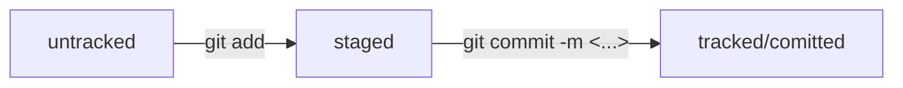

Шпаргалка по Git 
---
1. **Инициализация репозитория**
```bash
git init
```

2. **Коммит в локальном репозитории**
```bash
git add . (или git add -all)
git commit -m "<message>"
```

3. **Просмотр лога коммитов**
```bash
git log (или git log --oneline)
```

4. **Генерация ssh ключей**
```bash
ls -lah ~/.ssh
ssh-keygen -t ed25519 (или -t rsa -b 4096) -C <"github e-mail">

cat id_<ed25519 or rsa>.pub | xclip
```

_Затем нужно вставить ключ в настройках гитхаба и далее проверить что всё ок_


```bash
ssh -T git@github.com
git remote add origin git@github.com:%ИМЯ_АККАУНТА%/%ИМЯ_РЕПОЗИТОРИЯ%.git
git push -u origin main (потом просто git push)
```

---

Файл HEAD (англ. «голова», «головной») — один из служебных файлов папки .git. Он указывает на коммит, который сделан последним (то есть на самый новый).

```bash

cat refs/heads/master # взяли ссылку из файла HEAD
# внутри хеш
e007f5035f113f9abca78fe2149c593959da5eb7
```
---
### Статусы файлов



---
### Стиль комментариев на коммиты

Для сообщений на русском языке часто рекомендуют использовать инфинитивы. Например: Исправить ошибку #123 и так далее.
Для сообщений на английском рекомендуется использовать повелительное наклонение (англ. imperative). Например: Fix exit button и так далее.

---
### Добавление к HEAD коммиту новых файлов
```bash
$ git add common.css
# добавили файл common.css в список на коммит как обычно

# но вместо команды commit -m '...'
# будет:
$ git commit --amend --no-edit

$ git log --oneline
8340eb2 Добавить главную страницу
# коммит в истории всё ещё один (но у него новый хеш) 
```
---
### Откат изменений

Выполнить unstage изменений  
```bash 
git restore --staged <file>
```

«Откатить» коммит
```bash 
git reset --hard <commit hash>
```

«Откатить» изменения, которые не попали ни в staging, ни в коммит
```bash
git restore <file>
```

---


### Посмотреть изменения

Команда 
```bash 
git diff 
``` 
сравнит последнюю закоммиченную версию файла с той, что находится в состоянии modified.
Команда
```bash 
git diff --staged
``` 
покажет изменения в staged-файлах относительно последних закоммиченных версий.
```bash
git diff a9928ab 11bada1 
```
покажет различия коммитов с хешами a9928ab и 11bada1.


---

### .gitignore

```bash
.DS_Store
 
# игнорировать все файлы, которые заканчиваются на .jpeg
*.jpeg

# игнорировать все файлы "tmp" во всех подпапках папки docs
docs/*/tmp

# ? - один любой символ
file?.txt

# игнорировать файлы file0.txt, file1.txt и file2.txt
# при этом не игнорировать file3.txt, file4.txt, ...
file[0-2].txt

# игнорировать todo.txt в корне репозитория
/todo.txt

# для сравнения: spam.txt будет игнорироваться во всех папках
spam.txt

# игнорировать папку build
build/

# игнорировать файлы "docs/current/tmp", "docs/old/tmp",
# а также "docs/old/saved/a/b/c/d/tmp"
# и даже "docs/tmp", потому что ноль вложенных папок тоже подходит
docs/**/tmp

# игнорировать только "docs/current/tmp" и "docs/old/tmp"
# файл "docs/old/saved/a/b/c/d/tmp" не попадает в правило
docs/*/tmp

# игнорировать все JPEG-файлы
*.jpeg

# но только не мем с Doge
!doge.jpeg 
```
Показать игнорируемые файлы
```bash
git status --ignored
```

---

Команда 
```bash
git clone
``` 
копирует проект на локальный компьютер. Она автоматически связывает локальный репозиторий с удалённым.

---

# Ветки в Git 

Чтобы создать ветку, необходимо выполнить команду 
```bash
git branch %BRANCH_NAME%
```

Для перехода в ветку есть команда 
```bash
git checkout %BRANCH_NAME%
``` 
---

Покажи разницу между тем коммитом, который был два коммита назад, и текущим.
```bash
git diff HEAD~2 HEAD 
```


Удали ветку br-name, но только если она является частью main;
```bash
git branch -d br-name 
```

Удали ветку br-name, даже если она не объединена с main.
```bash
git branch -D br-name 
```

Объедини ветку main с текущей активной веткой.
```bash
git merge main 
```

Отправь новую ветку my-branch в удалённый репозиторий и свяжи локальную ветку с удалённой, чтобы при дополнительных коммитах можно было писать просто git push без -u;
```bash
git push -u origin my-branch
```

Отправь дополнительные изменения в ветку my-branch, которая уже существует в удалённом репозитории;
```bash
git push my-branch
```

Подтяни изменения текущей ветки из удалённого репозитория.
```bash 
git pull
```

---

### Разрешение конфликтов
```bash
<<<<<<< HEAD
version 1
=======
version 2
>>>>>>> br2 
```
Текст между <<<<<<< HEAD и ======= указывает на изменения, которые находятся в HEAD — в данном случае это ветка main. Здесь окажутся только те строки, в которых есть конфликт.
Текст между ======= и >>>>>>> br2 показывает на изменения, которые находятся в ветке br2.
Чтобы разрешить конфликт вручную, нужно открыть файл и выбрать, какие изменения оставить, а какие отбросить. Для этого следует удалить все маркеры и ненужные изменения и оставить нужные. После разрешения конфликта файлы будут отмечены как решённые. Можно продолжить процесс слияния или выполнить коммит изменений.

